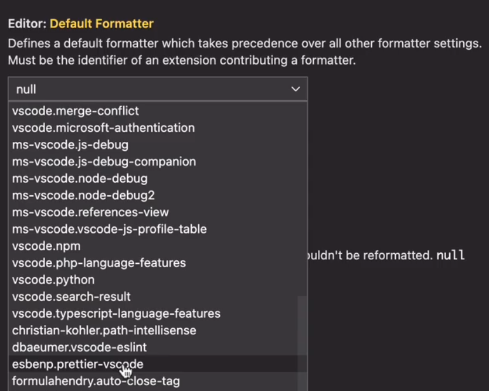
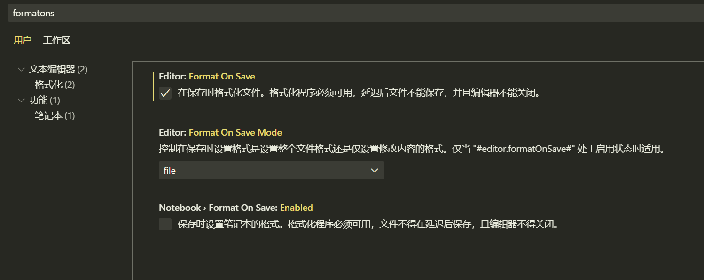
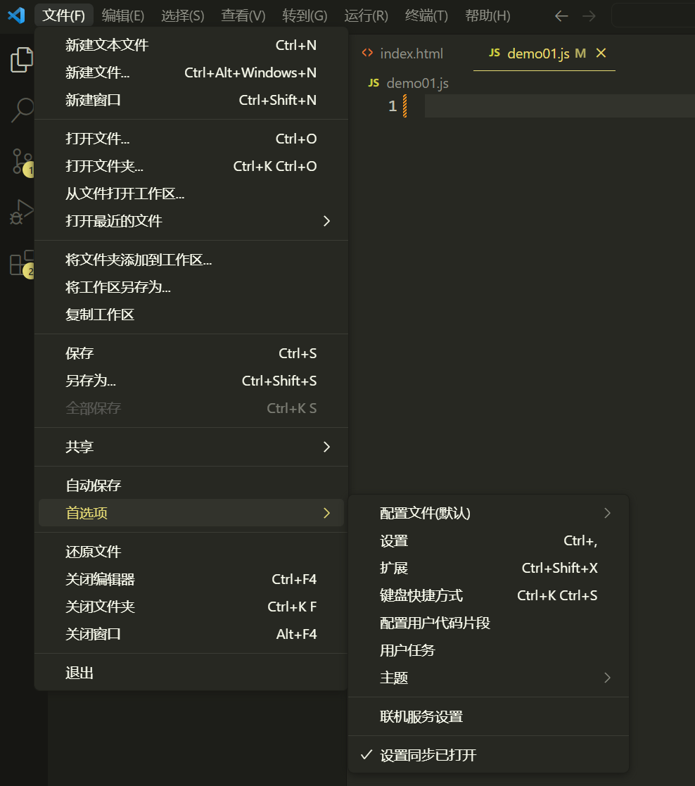
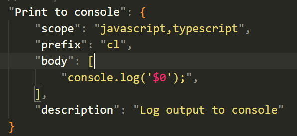
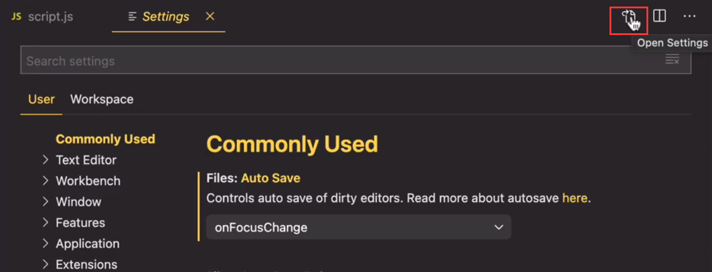
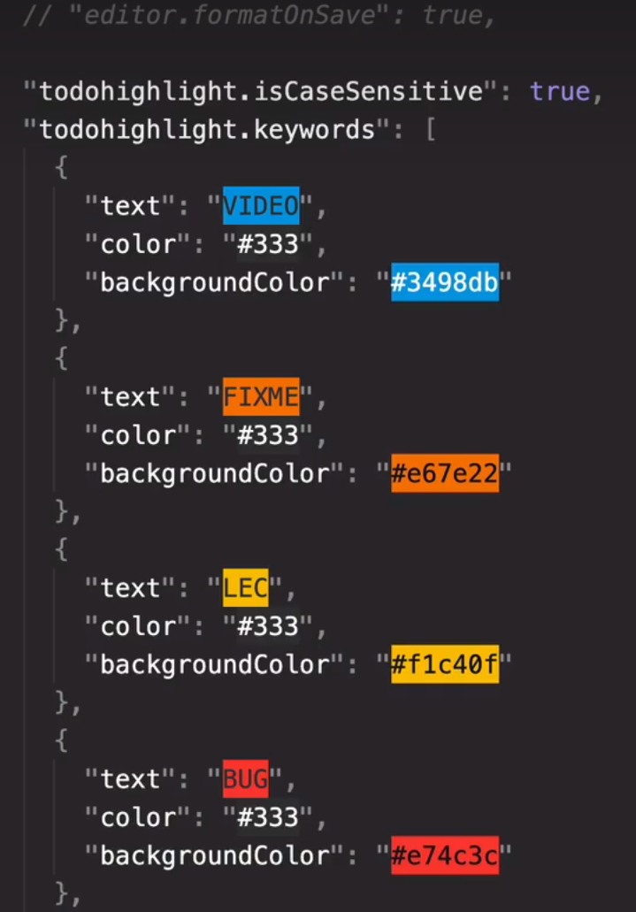
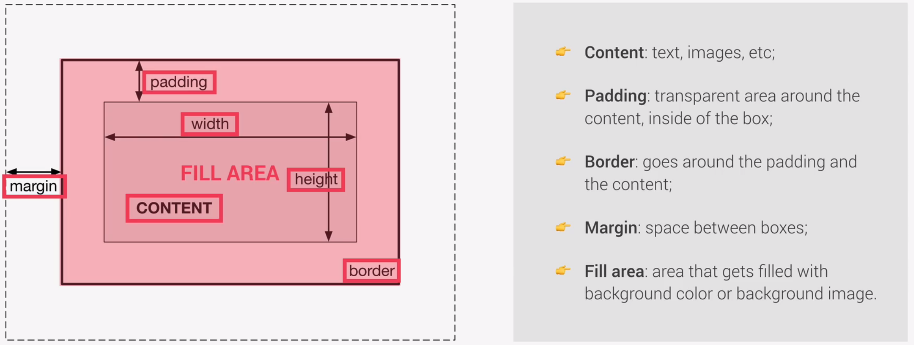

# JavaScript

ES5——ECMAScript

ES6/ES2015——The biggest change to the Lan. ever

## 引言

### 0. 记背

**Number()——强制类型转换，转为数字类型。**

**prompt(“Please input some words!”)——类似于scanf()，并且可以接收值。**

**&&、||、！——逻辑运算符**

**switch Statement：**

```javascript
switch(name){
	case 'Jack':...;
    case 'Lily':break;
    default:...;
}
```

### 1. 外联代码

	<script>xxx<script>

```js
变为：<script src="script.js"></script>
// script.js编写逻辑，位于同级文件夹中。
```

### 2. 变量

- 命名方式：
  - 驼峰式命名
  - 若变量为常量，全字母大写（e.g. PI）

- 变量类型：
  - dynamic typing，无需定义，自动生成
  - Value has type，NOT variable！
  - 如果是undefined，表示value和type都没有定义

- 变量定义不是强制的，但在真正编写过程中是必须的。
  - Never use a variable without declaring them.

### 3. 字符串

- template literals

```javascript
'My name is ${firstname} ${lastname}'
```

- Mutiple-Line String

```javascript
//just using '\' to start a new line.
```

- Length

```javascript
len = str.length
```

### 4. 两种相等运算符

- Strict equal operator

```javascript
//No Forced type convertion
>> 18 === 19
>> false
//Opposite
>> 18!=='18'
>> true
```

- Loss equal operator

```javascript
// Forced type convertion
>> '18'==18
>> true
//Opposite
>> 18!='18'
>> false
```

### 5. ES6->5版本的向下兼容&转译

- ES6是最新语言版本，可以backward compatible ES5，为最新版本的js，但不一定支持所有浏览器
- 因此，需要将ES6->transpile->ES5。
  - Use *Babel* to transpile and polyfill your code.

### 6. 数组 Array

- 表达方式

```javascript
//1. initiate.
const friends = ['mike','lily','culy']
//2. use 'new'.
const years = new Array(1991,1992,1993)
```

- **数组可以嵌套！！**

```javascript
>> const emotions = ['angry','laughing']
>> const data = ['happy','sad','excited',emotions]
>> data->['happy','sad','excited',Array(2)]
```

- 常见方法：
  - .push()_增加
  - .unshift()_开头增加
  - .shift()_开头删除
  - .pop()_删除
  - .indexof(…)_查找
  - .include(…)_包含：**使用严格相等运算符**
  - **.length_长度**

## 逻辑 Logistic

### 1. for Loop

:repeat_one: How it work？

```javascript
//for loop keeps running while condition is TRUE.
for(let rep=1;rep<=10;rep++){
    console.log('The num is ${rep}')
}
```

:repeat_one: `Continue` and `Break`

```
for(let rep=1;rep<=10;rep++){
    if(rep<5){continue;}
    else{break;}
}
```

:repeat_one: **You can use `for` to traverse the array.（But not recommended!!)**

---

### 2. while Loop

```javascript
rep=0
while(rep<=10){
	//not forget to add the loop condition
	rep++;
}
```

## 函数 FUNCTIONS

### 1. 函数构建方法

:one: function definition

```javascript
//Definition
function login(password){...}
//Using
login();
```

:two: anonymous function

```js
//functions are just VALUEs, not a type
const loggn01 = function (password){...}
//Using
loggn01('197100');
```

:three: arrow function

```javascript 
//Definition
const loggn02 = password => {...}
//Using1
loggn02('197100');
//Multiple Input
const loggn02 = (password,name,id) => {...}
//Using2
loggn02('197100','cyz',156);
```

## 对象 Object

注意对象的属性之间，用`,`分隔。

### 1. 索引方式

:one: Object.<property name>

:two: Object.[<property name String>]	——适用于需用户输入属性名称的字符串的场景。

### 2. 方法 Method

```javascript
//demo01
const jonas={
    name:'Jonas',
    year:'20',
    //引入方法 Method，类似匿名函数
    calcAge: function (birthYear) {
        return 2000+year;
    }
}
```

### 3. this关键字

**:star2:th​i​s​指向​的​是->​调用​该函数​的​对象。:star2:**

:star2:因此，*对象*内部的*方法*，如果输入*参数*是该对象内部的*属性*，那就不用再写明输入参数，直接在函数体内调用。

**this作为输入参数。**

```javascript
//demo02
const jonas={
    name:'Jonas',
    year:'20',
    //引入方法 Method
    calcAge: function () {
        return 2000+this.year;
    }
}
```

**this作为返回值，用于创建新属性,不用再额外定义。**

```javascript
//demo02
const jonas={
    name:'Jonas',
    year:'20',
    //引入方法 Method
    calcAge: function () {
        this.age = 2000+this.year
        return this.age;
    }
}
```

# Start coding

## 1. 插件配置 Plugins

## prettier

**1）加载prettier插件并配置**



**2）开启“format on save”**



## code snippets（Self defined）

**1）选择【文件】|【首选项】|【配置用户代码片段】|【新建全局代码片段文件】**



**2）配置代码片段的规则**



## TODO Highlight

**0）添加TODO highlight 插件**

**1）打开settings->选择open settings（json）**



**2）在json文件中增加此项目**



## Live Server

Just download it in PLUGINS.

**点击vs下方的“go live”进入插件工作**

Ability：To catch code change immediately.

## 2. 解决问题的步骤&Using online Tools

- **Breakdown a question into several sub-questions.**
- **Search sub-questions in Google|stack overflow|MDN**

| Q: How to get max value in array?              |
| ---------------------------------------------- |
| on Google: ‘javascript get max value in array’ |
| on stack overflow                              |
| on MDN                                         |

- **Finishing code and debugging**

## 3. 盒子模型 CSS BOX MODEL



**Tips:**

- 通常一些元素会自动获得特定的边距。
- 因此，一般会需要重置所有的margins和paddings。

```
*{
	margin:0;
	padding:0;
	box-sizing:border-box;	//固定盒子宽高，不会受padding影响而变化
}
```

*一些示例：*

```
body{
	background-color: xx;
	font-family: xx;
	padding: 75px
}
```

