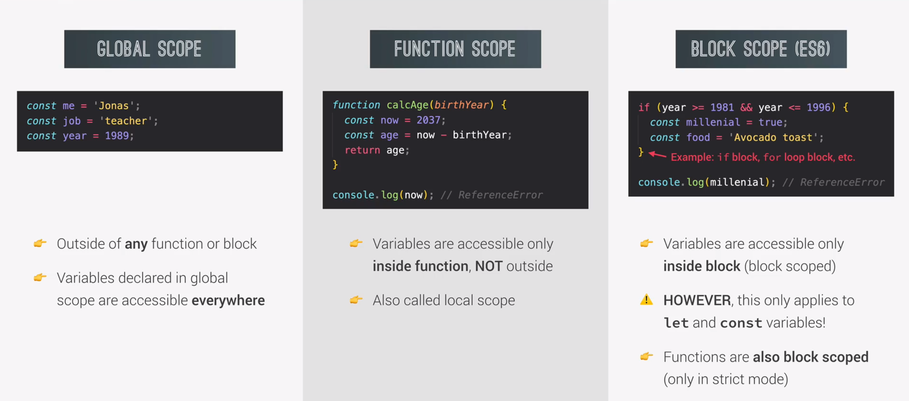
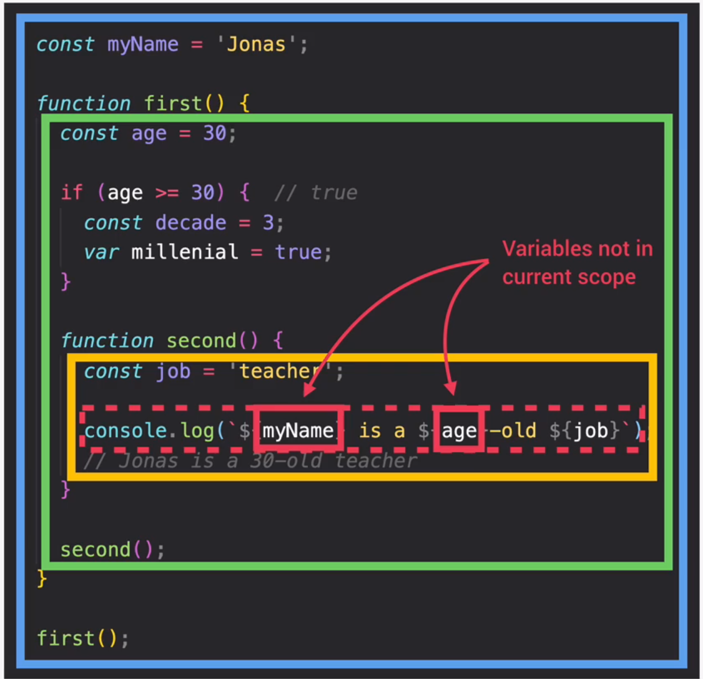
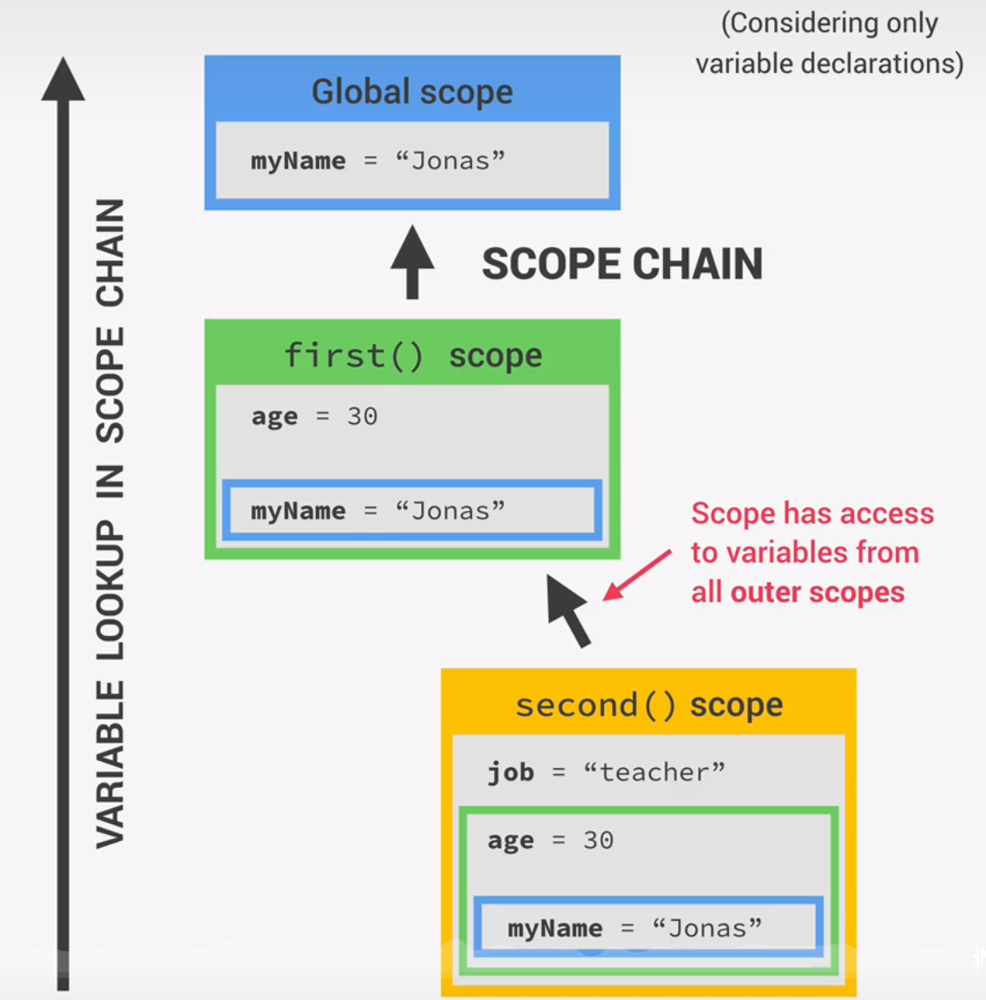
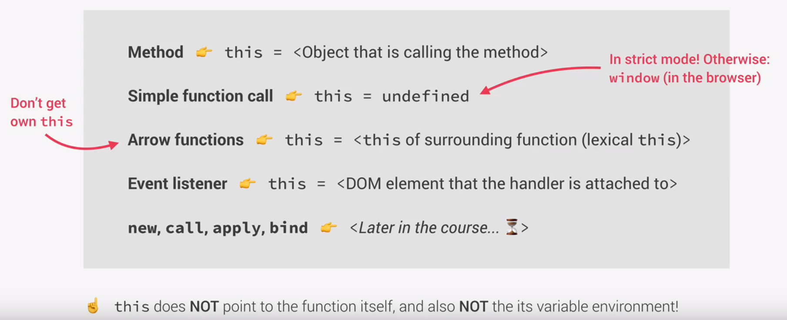
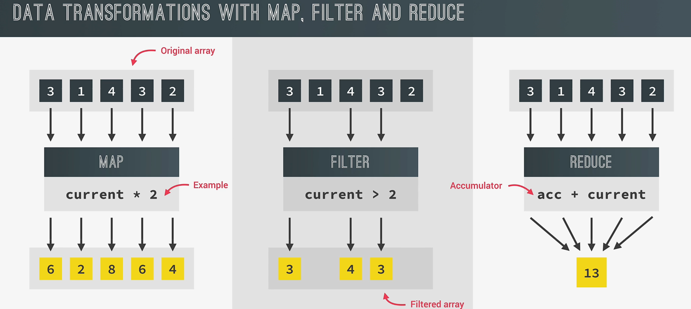
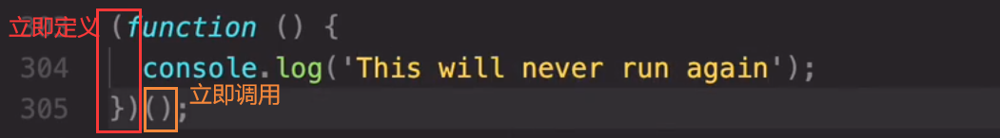
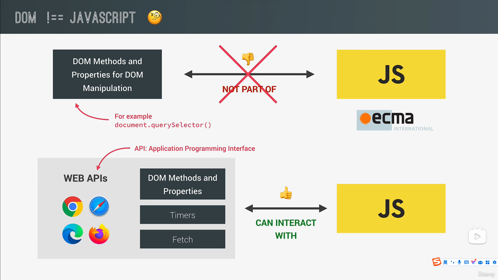
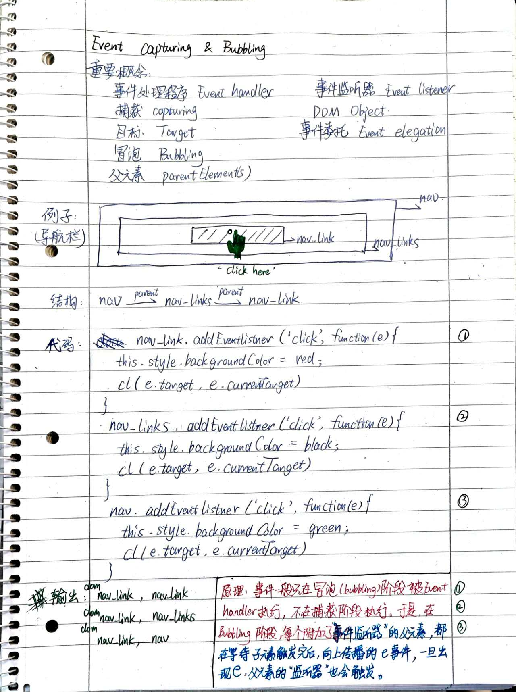

# Highlevel of Javascript

[Javascript特性全介绍](https://www.bilibili.com/video/BV1vA4y197C7?p=82&vd_source=8dc54cf39177c5741ce7a3bfa533ee29)

### 0. 执行上下文 Execution context

| Execution context’s Parts |
| ------------------------- |
| - Variable environment    |
| - Scope chain             |
| - this keyword            |

### 1. 堆栈 call stack

| :star2:Execution context’s Parts |
| -------------------------------- |
| - Variable environment           |
| - Scope chain                    |
| - this keyword                   |

**基本原理：**

​	JS代码运行于execution context（执行上下文,EC）中，EC运行于call stack（堆栈）中，call stack（堆栈）+heap（堆）构成了JS的ENGINE（引擎）。以下是一个ENGINE的实例：

​	进入堆栈后，GLOBAL先运行，而后是first()，最后是second(). 每次运行完毕就从堆栈中清除相应函数，

| **——————CALL STACK—————=**             |
| -------------------------------------- |
| ….                                     |
| second()【被对应函数执行上下文所包裹】 |
| first()【被对应函数执行上下文所包裹】  |
| **GLOBAL【被全局执行上下文所包裹】**   |

### 2. 变量范围 Scope

> ***ES6以前 +ES6版本新增内容***
>
> ES6之前，共有2个变量尺度：global和function
>
> ES6版本，新增block scope，使用let或const定义的变量仅在block（e.g. if，for，do while）可访问；但是用var仍是function尺度的变量定义方式。



### 3. 范围链 Scope chain

| Execution context’s Parts |
| -------------------------------- |
| - Variable environment           |
| :star2: Scope chain                    |
| - this keyword                   |

> **遵循“地头蛇”原则**
>
> 从块->函数->全局范围，依次搜索变量的declaration（初始化），若都不存在，则报错。

|  |  |
| ------------------------------------------ | ------------------------------------------ |
| **Fig 1. 代码示例**                        | **Fig 2. 变量搜索逻辑**                    |

### 4. 变量环境 Variable environment-Hoisting
| Execution context’s Parts |
| -------------------------------- |
| :star2: Variable environment           |
|  - Scope chain                  |
| - this keyword                   |

> **Hoisting：**
>
> ​	Makes some types of variables accessible/usable in the code **before they are actually declared**. "Variables **lifted** to the **top of their scope**"
>
> **How Hoisting？（Behind the scene）**
>
> ​	**Before execution**, code is scanned for variable declarations, and for each variable, a new property is created in the variable environment object.
>
> **Why Hoisting？**
>
> ​	Using functions before actual declaration.
>
> **Why Temporal Dead Zone（TDZ）？**
>
> ​	TDZ中的变量和未初始化的变量，程序报错是不同的。TDZ中的提示是初始化应在前；未初始化变量则是直接报错。
>
> ​	TDZ能够保证`const` variables真正起到作用.

### 5. 关键字 this

**详细的使用场景介绍：**



> **面临的困境：**

```javascript
const jonas={
 year:1992,
 calcAge:function(){
 	const isMedium = function(){
 		console.log(this);	
 		console.log(this.year);	//此时this将输出undefined，this.year无值。
 	}
 }
}
```

> **ES6之前的解决方案：**

```javascript
//Solution 1#:添加外层的self变量，因为外层函数内的this可以访问jonas对象。
const jonas={
 year:1992,
 calcAge:function(){
    const self = this;	//添加该句。使用self来存储this（即jonas对象）
 	const isMedium = function(){
 		console.log(this);	
 		console.log(this.year);	//此时this将输出jonas，this.year=1992。
 	}
    isMedium();	//触发isMedium()
 }
}
```

> **ES6的解决方案 [推荐] ：**

```javascript
//Solution 2#:内层arrow function，直接继承外层的this含义。
const jonas={
 year:1992,
 calcAge:function(){
 	const isMedium = () => {	//采用arrow func，那么this会继承父作用域的指代范围。
 		console.log(this);	
 		console.log(this.year);	//此时this将输出jonas，this.year=1992。
 	}
 	isMedium();	//触发isMedium()
 }
}
```

### 6. 关键字 arguments

**用于函数传参。这一关键字在现代js中已经不再重要，因为已经有了上位替代。arguments只存在于常规函数中，不存在于箭头函数中。**

### 7. 对象代理 Primitives vs. Objects

**参见[P92 Primitives vs. Objects (Primitive vs. Reference Types)](https://www.bilibili.com/video/BV1vA4y197C7/?p=92&spm_id_from=pageDriver&vd_source=8dc54cf39177c5741ce7a3bfa533ee29)**

### 8. 扩展运算符 Spread Operator

> **用于数组 Array类型，以遍历方式取出某个array的所有值**
>
> ```
> const obj = {
> 	old:[1,2,3,4],
> }
> const new = [12,67,...obj.old]	//[12,67,1,2,3,4]
> ```
>
> ```
> console.log(...new)			//[12,67,1,2,3,4]
> ```
>
> **用于字符串 String类型，以遍历方式取出每个char**
>
> ```
> const str = 'jonas'
> const letter = [...str,'i','s','teacher'] 	//['j','o','n','a','s','i','s','teacher']
> ```
>
> **甚至，能用于函数传参**
>
> ```
> const ingredients = ['mushroom','passata','powder']
> const makePasta = function(ing1,ing2,ing3){}	//定义函数
> makePasta(...ingredients){
> 	console.log(ingredients[0]);
> 	console.log(ingredients[1]);
> }	//调用函数
> ```
>
> **也可以用于对象 Object的浅拷贝(而非深拷贝）**
>
> ```
> const shallowCopy_obj = {...myObj}
> ```

### 9. 左扩展运算符 Rest Operator

> **其实就是扩展运算符Spread位于表达式的左侧。**
>
> ```
> const [a,b,...others] = [1,2,3,4,5]		//others = [3,4,5]
> ```
>
> **注意：syntax error：Rest element must be the last element. & Should be only one.**
>
> ```
> const [a, ,b,...others,c] = [1,2,3,4,5,6]	//报错(x)
> const [a, ,b,...others] = [1,2,3,4,5,6]	//正确(√)
> ```
>
> **甚至，也能用于函数传参**
>
> ```
> const makePasta = function(ing1,...otheringre){}	//使用Rest定义函数
> makePasta('mush','passata','powder'){}
> ```

### 10. ES6 enhanced Object Literals

```javascript
{name:name} => {name}
```

### 11. ES6 关键字this的转移-apply/bind

- **bind()用于显式地定义某个this的指向**
- **应用场景：**
  - 1）对象01欲调用对象02的方法时
  - 2）想基于一个函数生成另一函数时
- **应用规则：**
  - 解释：方法的原生对象，赋予其他对象使用该方法的权利，所以不是绑定，而是赐予。
  - 语法：`obj01.<func_name>.bind(obj02,param1,param2,....)`
  - 解释：其中的param1,param2，会在obj02调用时，代替前n个参数，使其成为固定值。
- **应用演示：**

```javascript
/// 1# 对象方法互调用 ///
// exam1 //
const obj01 = {
	name:'cyz',
	address:'Salzburg',
	book(name,address){
		console.log(this.name,this.address)
	}
}
const obj02={
	name:'tyq',
	address:'Hangzhou'
}
const booking = obj01.book; booking('wxz','Jilin'); //报错(x)
const booking02 = obj01.book.bind(obj02); booking02(obj02.name,obj02.address)	//正确(√)

// exam2 //
document.querySelector('.welcome').addEventListener('click',obj01.book.bind(obj01))	//因为addEventListener中this为DOM对象，导致结果为undefined
```

[exam2解释](# 5. 关键字 this)

[bind()在addEventListener中的妙用](#5.  函数传入方式 Passing Arguments)

```javascript
//2# 简化函数-作用其实有限-只是一个新应用场景
const addTax = (rate,value)=>value+value*rate;
const addTaxNew = addTax.bind(null,0.23);	//无需绑定对象，输入null，rate===0.23
addTaxNew(2000);
```

### 12. 闭包 Closure

### 13. DOM对象作为keys

> ***示例01：selector搜索DOM+array.from批量操作，构建数组***
>
> ```javascript
> const my_movements = Array.from(document.querySelectorAll('.movements'),	//步骤1：搜索所有DOM对象，构建DOM数组
> (elem)=>Number(el.textContent.replace('€',' ')));						//步骤2：替换所有DOM对象中的'€'符号为''
> ```

### 14. 事件 e

`e` 是事件对象（Event Object）的缩写

事件对象是在触发事件时由浏览器自动创建的，它包含了与事件相关的信息。

在 `addEventListener` 方法[监听事件](#5. 监听事件 Event-Listener)中，通常会传递一个事件处理函数，并且浏览器会在调用这个函数时自动传递一个事件对象作为参数，这个参数通常被命名为 `e` 或者 `event`。例如：

```
document.getElementById('myButton').addEventListener('click', function(e) {
  e.preventDefault()；
});
```

事件对象 `e` 可以包含各种属性和方法，其中常用的一些方法包括：

- `e.preventDefault()`：阻止事件的默认行为（比如阻止表单提交或链接的跳转）。
- `e.stopPropagation()`：阻止事件进一步传播，即组织父元素的触发（事件冒泡或事件捕获）。
- `e.target`：获取触发事件的元素。
- `e.currentTarget`：获取事件监听器附加的元素。(在事件冒泡时，e.currentTarget一般**不等于**e.target)
- `e.type`：获取事件的类型（例如，'click'、'mouseover' 等）。
- `e.clientX` 和 `e.clientY`：获取鼠标相对于浏览器窗口的水平和垂直坐标等。

除了在 `addEventListener` 中，事件对象 `e` 还会出现在其他处理事件的地方，比如在内联事件处理器中（即 HTML 中的 `onclick`、`onmouseover` 等事件处理属性中）也可以使用事件对象。

### 15. Nodes(List)&HTML collections

- **Nodes(List)**

> **为动态的类Array对象，拥有一些数组的方法,如 `forEach`、`entries`、`keys`、`values`,但不是所有数组方法都能使用。**
>
> 可以使用“…”来转为数组，但也可以直接forEach()
>
> ```
> [...nodeList]
> ```

- **HTML collections**

> **为静态的类Array对象，可以通过索引访问元素，但它没有数组的方法，比如 `forEach`、`map`、`filter` 等。**
>
> 只能使用“…”来转为数组
>
> ```
> [...htmlCollection]
> ```
>

### 16. 用户缓存 Cookies

```javascript
document.cookie //获取cookies
```

### 17. 本地/会话用户存储 localStorage/sessionStorage

- 下述方法，在没值时都会返回***NULL***，而非undefined。
- **sessionStorage会随浏览器关闭而消失，localStorage则不会。**
- **用户可以通过主动清理缓存，清除二者。**

```javascript
localStorage.setItem('msg',JSON.stringify(myObj));	//add
JSON.parse(localStorage.getItem('msg'));			//get
localStorage.removeItem('msg')					//delete
localStorage.clear('msg')						//delete ALL
//————————————————————————————————————————//
sessionStorage.setItem('msg',JSON.stringify(myObj));	//add
JSON.parse(sessionStorage.getItem('msg'));			//get
sessionStorage.removeItem('msg')				//delete
sessionStorage.clear('msg')						//delete ALL
```

### 18. 导入语句 Import

1. `import`遵循优先逻辑。一个js文件会被提前扫描，无论`import`语句在哪里，都会先一步执行。	

# JavaScript

ES5——ECMAScript；ES6/ES2015——The biggest change to the Lan. ever

## 引言 Intro

### 0. 记背

**Number()、String()——强制类型转换，转为数字类型。**

**&&、||、！——逻辑运算符**

**switch Statement：**

```javascript
switch(name){
	case 'Jack':...;
    case 'Lily':break;
    default:...;
}
```

### 1. 外联代码

	<script>xxx<script>

```js
变为：<script src="script.js"></script>
// script.js编写逻辑，位于同级文件夹中。
```

### 2. 变量

- 命名方式：
  - 驼峰式命名
  - 若变量为常量，全字母大写（e.g. PI）

- 变量类型：
  - dynamic typing，无需定义，自动生成
  - Value has type，NOT variable！
  - 如果是undefined，表示value和type都没有定义

- 变量定义不是强制的，但在真正编写过程中是必须的。
  - Never use a variable without declaring them.

### 3. 字符串

- template literals

```javascript
'My name is ${firstname} ${lastname}'
```

- Mutiple-Line String

```javascript
//just using '\' to start a new line.
```

- Length

```javascript
len = str.length
```

### 4. 两种相等运算符

- Strict equal operator

```javascript
//No Forced type convertion
>> 18 === 19
>> false
//Opposite
>> 18!=='18'
>> true
```

- Loss equal operator

```javascript
// Forced type convertion
>> '18'==18
>> true
//Opposite
>> 18!='18'
>> false
```

### 5. 日期 Date

**定义 Definition: 注意！其中month为输入值i+1**

```javascript
const now = new Date()	//默认返回当前时间
const future = new Date(2037,10,15,15,30,58)	//时间为2037年11月15日,15:30:58
const future = new Date(214225698000)	//时间戳格式
```

**方法 Methods**

- **.<get……>()**_获取某个时间单位，如.getDay, .getHours, etc.
- .<set……>()_设置某个时间单位，如.setFullYear(2048)
- **Date.now()**_获取当前时间戳 timestamp
- **[Internationalizing Dates (Intl)](https://www.bilibili.com/video/BV1vA4y197C7?p=167&vd_source=8dc54cf39177c5741ce7a3bfa533ee29)**

**基于时间戳的计算**

1. **Number()转为数值**

2. **相减，得到单位为毫秒（ms）的时间戳差值**

### 6. ES6->5版本转译

- ES6是最新语言版本，可以backward compatible ES5，为最新版本的js，但不一定支持所有浏览器
- 因此，需要将ES6->transpile->ES5。
  - Use *Babel* to transpile and polyfill your code.

### 7. CSS如何选择根元素<html>，再用DOM访问？

- **使用伪类选择器`:root{}`，root这个名称是固定不可变的**
- **访问方式`document.documentElement`**

## ES6 映射 Map

- **与python的字典相似，但最大区别在于，可以哈希**

### 1. 创建方式

```
const rest = new Map();
```

### 2. 赋值方式

```javascript
//方式一
rest.set(1,'a')
//方式二
const rest = new Map([
[1,'a'],[2,'b'],[3,'c'],[4,'d']
]);
//方式三,convert object to map
const obj = {
  key1: 'value1',
  key2: 'value2',
  key3: 'value3'
};
const map = new Map(Object.entries(obj));
```

### 3. 映射方法 Method

- .set(x,y) 输入键值对
- .get(x) 利用键，获取值
- .delete(x) 删除符合条件的键值对
- .clear() 清空映射集合
- **.size属性**
- .has(x) 检查是否有某个键
- **.forEach(`callback`)_回调函数**
  - MapforEach：回调函数的默认传参(value,key,map)=>{}

> **映射，甚至可以接受DOM标签作为key，借此来完成一些高级操作**
>
> ```javascript
> Map.set(document.querySelector("h1"),"Heading")
> ```

## 字符串 String [Hard]

### 1. 字符串方法 Method

- .length()_长度
- .indexof(…)_查找第一次出现，如果不存在返回-1
- .lastindexof(…)_查找最后一次出现
- .slice(x,y)_切片，左闭右开
- .toLowerCase()_大小写转换
- .trim(…)_去除前/后的无效空格，中间的不用删去！
- .replaceAll(‘x’,‘y’)_将所有x替换成y
- .includes(x)_是否包含x
- .startsWith()/.endsWith()
- .split()_转为数组
- **用于Array合并:** arr.join(‘ ’)
- .padStart(num,x)/.padEnd(num,x)_补全字符串

### 2. 字符串高级方法 Adv-Method

- **判断一个字符串中是否有指定的字符？**

## 运算符 Operator

### 1. OR assignment operator (FALSY, including 0 or ‘ ’)

```javascript
restaurant.startime = restaurant.startime || 10;
restaurant.startime ||= 10;	//如果为Falsy，则赋值10；如果不Falsy，则维持原状
//存在bug：如果为0，判断为falsy，则赋值10
```

> ***解决方案如下：***

### 2. Nullish assignment operator(Null, Not 0 or ‘ ’)

```javascript
restaurant.startime = restaurant.startime ?? 10;
restaurant.startime ??= 10;	//如果为NULL，则赋值10；如果Not NULL，则维持原状
//解决bug：如果为0，判断为Not NULL，则维持原状
```

### 3. Optional Chaining(?.)

```javascript
console.log(restaurant.openingHours?.monday?.open) 	//如果?前的对象均存在，则返回.open；否则，返回undefined
console.log(restaurant.openingHours?.monday?.open ??= 10) //可以与Nullish Assign结合使用
```

## 数组 Array

### **1. 数组表达方式**

```javascript
//1. initiate.
const friends = ['mike','lily','culy']
//2. use 'new' with content
const years = new Array(1991,1992,1993)
//3. use 'new' with length
const years = new Array(4)	//一种运算符的重载~
```

### **2. 数组可嵌套**

```javascript
>> const emotions = ['angry','laughing']
>> const data = ['happy','sad','excited',emotions]
>> data->['happy','sad','excited',Array(2)]
```

### **3. 数组方法 Method**

**不支持回调：**

- **.hasOwnProperty()**_是否有某个属性

- .push()_增加
- .keys()
- .values()
- **.entries()**_获取元素及其序号
- .unshift()_开头增加
- .shift()_开头删除
- .pop()_删除
- .includes(x)_是否存在
- .indexof(x)_查找，但仅返回第一个匹配项的索引
- .length_长度
- .splice(x=<startNumber>,y=<deleteLength>)_删除元素，慎用！
- .reverse()_倒序
- arr1.concat(arr2)_数组链接【当然也可以用扩展运算符实现】
- .join(‘x’)_连接元素为字符串
- .flat(n)_n维扁平化 

---

**支持回调：**

- **Array.from({},`callback`)**_*lamda(λ)*表达式

```javascript
//自定义
const checkArr = Array.from( { length:7 } ,(v,i)=>i+1);
//搜索多个DOM构造数组
const checkArr = Array.from( document.querySelectorAll('.guess'));
```

- **.forEach(`callback`)**_用于单独处理各元素 
  
  - ArrayforEach：回调函数的默认传参(elem, index, arr)=>{}
  
- 【ES6】**.find(`callback`)**_按序查找第一个且仅一个符合的元素，可用于登录

  - ```javascript
    //可用于前端写的登录逻辑
    acc1={name:'cyz',age:18};acc2={name:'cyz',age:19};acc3={name:'cyz',age:20};
    const accounts = [acc1,acc2,acc3];
    accounts.find((acc)=>acc.age===20);
    ```

- 【ES6】**.findIndex(`callback`)**_indexof的升级版，也仅返回第一个匹配项的索引

- **.some(`callback`)**_includes的升级版

  - ```javascript
    const checkArr = arr.some((num)=>num>1500)	//有符合条件的就返回true
    ```

- **.every(`callback`)**_some的特殊情况，只有全部元素符合返回true

  - ```javascript
    const checkArr = arr.every((num)=>num>1500)	//全部元素符合条件就返回true
    ```


- **.sort(`callback`)**_reverse的升级版，返回值正负决定排序【非常重要！】

  - ```javascript
    const checkArr = arr.sort((a,b)=>a-b)	//负值则正序，正值则逆序。
    ```


- **.flatMap(`callback`)**_map+flat的合体，但仅支持一维扁平化

### 4. 数组高级方法 Adv-Method

- **map()_同foreach，单独操作每个变量[返回新数组，建议用map替代foreach]**

- [x] **map()是一种pure function，不会改变任何东西，没有side effect（副作用）**

```javascript
const arr = [1,23,4,5]	//输入の数组
const Arr = arr.map(function(v){
    3*v;	//如果是单句，如3*v，那就不用return，直接会生成新数组
})
```

- [x] **map()内部的回调形式。**

- [ ] ```javascript
  const discribeMovements = account1.movements.map(
      //类回调输入
    (v, i) =>
      //表达式
      `Movement ${i + 1}: You ${v > 0 ? "deposited" : "withdrew"} ${Math.abs(v)}`
  );
  ```

- **filter()_条件过滤[返回新数组]**:cry:

- **reduce()_降至一维[返回单变量，内部包括1个有4个参数的`回调函数`+1个`accumulation初始值`]**

  - reduce()中会不断产生return值，每一次return的都是上一步的结果。1. accumulation；2. accumulation+value1；3. accumulation+value2；……

```javascript
const myNums = [1, 5, 6, 7];
const reduceCalc = myNums.reduce((accumulation, value, index, arr) => {
  return accumulation + value;	//是回调函数，所以要return
}, 50);	//accumulation的初始值
console.log(reduceCalc);
```



### **5. 数组解构 destructuring**

```javascript
//1.常规数组-解构
const arr = [5,6];
const [i,j] = arr;
[i,j]=[j,i];	//交换顺序

//2.嵌套数组-解构
const nested_arr = [5,6,[8,9]];
const [i, ,[j,k]] = nested_arr;
/// i=5,j=8,k=9 ///

//3.自定义默认值
const arr = [5,8];
const [i,j,k] = arr;	//此时，k找不到对应值，所以为undefined。
const [i=1,j=1,k=1] = arr;	//设置默认值，若没有找到对应值，则使用默认值。
/// i=5,j=8,k=1 ///
```

### 6. 数组类型转换 form

> ***数组Array转Map***

```javascript
const usObj = new Map(Object.entries(myObj))
```

## 逻辑 Logistic

### 1. for Loop

:repeat_one: How it work？

```javascript
//for loop keeps running while condition is TRUE.
for(let rep=1;rep<=10;rep++){
    console.log('The num is ${rep}')
}
```

:repeat_one: `Continue` and `Break`

```
for(let rep=1;rep<=10;rep++){
    if(rep<5){continue;}
    else{break;}
}
```

:repeat_one: **You can use `for` to traverse the array.（But not recommended!!)**

---

### 2. while Loop

```javascript
rep=0
while(rep<=10){
	//not forget to add the loop condition
	rep++;
}
```

### 3. for-of Loop

- **用于数组Array的迭代器**

```javascript
const numlist = [1, 2, 4, 8, 16, 32];
//normal loop
for (const item of numlist) {
  console.log(item);	
}
//numeric+normal loop	
for (const item of numlist.entries()) {
  console.log(item);
}
```

- **用于对象Obj的迭代器**

```javascript
const entries = Object.entries(myObj)
for(const [key,{openhour,closehour}] of entries){	//这一步包含了解构对象
	console.log(key,openhour,closehour)
	//注意返回的key是字符串类型
}
```

- **用于字符串String的迭代器**

## 函数 Functions

### 1. 构造函数 function constructor

:one: function definition

```javascript
//Definition
function login(password){...}
//Using
login();
```

:two: anonymous function

```js
//functions are just VALUEs, not a type
const loggn01 = function (password){...}
//Using
loggn01('197100');
```

:three: arrow function

```javascript 
//Definition
const loggn02 = password => {...}
//Using1
loggn02('197100');
//Multiple Input
const loggn02 = (password,name,id) => {...}
//Using2
loggn02('197100','cyz',156);
```

### 2. 旋风函数  IIFE

- 全名： Immediately Invoked Function Expressions (IIFE)

- **用于只执行一次就消失的函数。匿名，外层括号包裹，结尾闭括号调用。**




## 高序函数 HighOrderFunction

### 1. 两种类别

> **1. 一个接受其他函数作为argument的函数**

```javascript
btnClose.addEventListener('click',greet=>{})
```

>  **2. 一个返回值为函数的函数**

```javascript
function count(){
	return function(){
		counter++;
	}
}
```

## 对象 Object

注意对象的属性之间，用`,`分隔。

### 1. 对象索引方式

:one: Object.<property name>

:two: Object.[<property name String>]	——适用于需用户输入属性名称的字符串的场景。

### 2. 对象中的方法 Method

- .toString()_转为字符串

```javascript
//demo01
const jonas={
    name:'Jonas',
    year:'20',
    //引入方法 Method，类似匿名函数
    calcAge: function (birthYear) {
        return 2000+year;
    }
}
```

- jonas.age = 32_定义新的属性及值

### 3. 关键字this

**:star2:th​i​s​指向​的​是->​调用​该函数​的​对象。:star2:**

:star2:因此，*对象*内部的*方法*，如果输入*参数*是该对象内部的*属性*，那就不用再写明输入参数，直接在函数体内调用。

**this作为输入参数。**

```javascript
//demo02
const jonas={
    name:'Jonas',
    year:'20',
    //引入方法 Method
    calcAge: function () {
        return 2000+this.year;
    }
}
```

**this作为返回值，用于创建新属性,不用再额外定义。**

```javascript
//demo02
const jonas={
    name:'Jonas',
    year:'20',
    //引入方法 Method
    calcAge: function () {
        this.age = 2000+this.year;
        return this.age;
    }
}
```

### 4. 对象操作 Obj-Operator

**拷贝：浅拷贝和深拷贝，区别在于能拷贝几层内容**

**1）浅拷贝-只能拷贝第1层的内容**

- 一旦对对象的深层属性进行操作，比如操作familyMember[]数组，那将应用于拷贝前/后的对象，发生`对象代理`的错误。

```javascript
//方式一
const shallowCopy_obj = Object.assign({},myObj)
//方式二
const shallowCopy_obj = {...myObj}
```

**2）深拷贝-可以拷贝所有层级的内容-比如，深度嵌套（deeply-nested）对象**

```js
const originalObj = { name: 'Alice', age: 25 };
const copiedObj = JSON.parse(JSON.stringify(originalObj));
$ Complicated! May use Lo-Dash to achieve.
```

**3）取出所有键/值**

```javascript
Object.keys(myObj);
Object.values(myObj);
Object.entries(myObj);

for(const [key, value] of entries){...}
```

### 5. 对象解构 destructuring

> 常用于API调用时解构数据，各种使用方式，见如下视频链接

```javascript
const {name,place,opentime:{start,end}} = restaurant_Obj;	//一般对象利用解构实现的接收方式
```

[**104 Destructuring Objects**](https://www.bilibili.com/video/BV1vA4y197C7?p=96)

## 集合 Sets

### 1. 集合方法 Method

- **.forEach(`callback`)**
  - 回调默认参数(value, _, set)=>{ }

## 数学 Math

### 1）convert and check numbers [Number]

```javascript
Number('30')	>>> 30
Number.parseInt('30xyz',10)/.parseFloat('2.5xyz',10)	>>> 30 2.5
Number.isNaN('30x')		>>> true,一般NaN识别是否为空，因此不会包含0和' '。  
Number.isFinite(20)		>>> true
```

**数字表示的国际转换：[Internationalizing Numbers (Intl)](https://www.bilibili.com/video/BV1vA4y197C7?p=168)**

### 2) 超大整数 [BigInt]

- **一种js-ES10/ES2020的数据类型，存放超大整数**

```javascript
Number.MAX_SAFE_INTERGER	//安全整数范围：<= 2**53-1
1233356465465465454564564n	//超限整数后加"n"，用于存储
```

### 3) 数学方法 Method

- 类比python，都是类似的函数

## 计时器 Timer

### 1. 常用函数

```javascript
//my_Emotion = 
      ['happy','sad']
//my_Timer = 
      setTimeout((emoj1,emoj2)=>console.log('I'm sad🙁),
           3000,
           ...my_Emotion)
```

```javascript
if(...) clearTimeout(my_Timer)	//取消计时器
```

```javascript
setInterval((emoj1,emoj2)=>console.log('I'm sad🙁),
	3000,
	...my_Emotion)
```

### 2. 传参规则

> ***——一种特殊的传参规则——***
>
> **下面代码中的**`'happy','sad'`**将被传入**`emoj1,emoj2`**中。**
>
> ```javascript
> setTimeout((emoj1,emoj2)=>console.log('I'm sad🙁),
>            3000,			//间隔触发时间
>            'happy','sad')	//秒数后的所有参数，都将被传入callback中
> ```

> 总结来说，如果在 `setTimeout()` 中**没有传递额外**的参数，那箭头函数内部定义的参数将会被赋予 `undefined` 值；
>
> 如果传递的参数数量**多于箭头函数**内部定义的参数数量，额外的参数会被**忽略**；
>
> 如果传递的参数数量**少于箭头函数**内部定义的参数数量，缺少的参数将会被视为 `undefined`。

## JSON方法

- `JSON.stringify()` 接受一个参数，将**JavaScript 对象或值**转为**json字符串**。
- `JSON.parse()` 将**json字符串**转换为对应的 **JavaScript 对象或值**。

```javascript
const myObj = { name: 'John', age: 30, city: 'New York' };
const jsonString = JSON.stringify(myObj);
```

# CSS Designer

## Css Principles

1. **选择器规则**：选择器规则定义a了要应用样式的HTML元素。常见的选择器包括元素选择器、类选择器、ID选择器、伪类选择器等。例如：

   ```css
   cssCopy code
   h1 {
     color: blue;
   }
   .button {
     background-color: #FF0000;
   }
   #header {
     font-size: 24px;
   }
   ```

2. **属性规则**：属性规则定义了要应用的具体样式属性和值。例如：

   ```css
   font-size: 16px;
   background-color: #EFEFEF;
   border: 1px solid #000;
   ```

3. **伪类规则**：伪类规则用于定义特定状态或行为下的样式。例如，`:hover` 用于定义鼠标悬停时的样式：

   ```css
   a:hover {
     color: red;
   }
   ```

4. **媒体查询规则**：媒体查询规则允许根据不同的设备属性（如**屏幕宽度、设备方向**等）应用不同的样式。这对于**响应式设计**非常有用。

   ```css
   @media (max-width: 768px) {
     /* 样式针对小屏幕设备 */
     body {
       font-size: 14px;
     }
   }
   ```

5. **字体规则**：字体规则用于定义字体的样式和属性。这包括 `@font-face` 规则用于引入自定义字体。

   ```css
   @font-face {
     font-family: 'MyCustomFont';
     src: url('myfont.woff') format('woff');
   }
   ```

6. **嵌套规则**：嵌套规则允许你在一个选择器内定义另一个选择器。这对于组织和管理样式非常有用。

   ```css
   ul {
     list-style: none;
     li {
       margin: 10px;
     }
   }
   ```

7. **@import规则**：导入外部url或apis对应的资源。

## Css attributes

**transform：移动属性**

​	scale(0.4)	#设置大小，比如图片大小

​	translateX(-500px)	#设置整体x位置偏移

​	translateY(200px)	#设置整体y位置偏移

//用例：点击arrow，改变slider.slide.translateX的偏移量，就可以实现图片转移

**overflow**

​	visible/hidden	#是否关闭流显示，如下图visible情况，即未关闭流显示


# DOM Coding

## 1. DOM != JavaScript

- **JS只是ECMAscript规定的一种方言**
- **但DOM方法已经被写入了JS，因此二者可以相互关联，用JS调用DOM API**



## 2. 创建DOM对象

- **问题：如何使用字符串创建一个/一批DOM对象？**
- **原理：遍历array->动态插值构造字符串->insertAdjHtml(Str)**
- **代码：实例[CODE](my-code/11script-Array-adv-methods.js)**

## 3. DOM树结构的遍历

### 1. 属性 Attribute：没有括号

- **子元素[返回HTML collections]** 

  - **.children**

    ```javascript
    >>> document.querySelector("h1").childNodes	//返回包含text的所有Nodes对象，很多并不是我们所感兴趣的
    >>> [br,span.height,span.width]		//返回HTML collections 对象
    ```
  
  - **.firstElementChild 第一个**
  - **.lastElementChild 最后一个**
  
- **父元素[返回HTML collections]**

  - **.parentElement**

- **兄弟元素[返回HTML collections]**

  - **.previousElementSibling**
  - **.nextElementSibling**

- **同级查找（高级操作）[返回HTML collections]**

  - **.parentElement.children** **获取同层（包含自身的）elements**

  - ```javascript
    [...domObj.parentElement.children].forEach(function(el){	//利用"...",将HTMLcollection转为数组
    	if(el!==h1) el.style.background = "#222222"				//修改h1兄弟姐妹的背景色
    })	
    ```


### 2. 方法 Method：带括号

- **.closest(<query-String>) 查找最近的**

  - .closest()方法实际上就是**querySelector()**的**反向**，查找的是**最近的、符合条件的父元素**。

  - ```javascript
    domObj.closest('.header').style.background = "var(--gradient-primary)"
    domObj.closest('p').style.background = "#1f56de"
    ```

# DOM Operator

## 1. 查询 query：返回Node(List)数组

> ***特点：数组元素不会随着页面内容的变化而变化。***

- **DOM.textcontent：标题、文本类标签**

```javascript
let myguess = document.querySelector(".guess").textcontent; //selectByClass
let myguess = document.querySelector("#guess").textcontent; //selectById
```

- **DOM.value：输入式标签**

```javascript
let myguess = document.querySelector(".inputt").value;
```

- **DOM.style.<style attribute name>：CSS样式表**
- 😍😍此时调用的**css属性**，要使用**驼峰式命名**，否则报错😍😍

```javascript
let mycolor = document.querySelector("body").style.backgroundColor;
```

- **DOMs：查找n个结果**

```javascript
>> let all = document.querySelectorAll(".host")
>> all[0],all[1],all[2],.....	//using 'for' statement to deal with
```

- **DOM.classList：访问某个标签的class**

```javascript
//If the class is a combined "modal model hidden".
document.querySelector(".month").classList.contains('hidden')	
document.querySelector(".month").classList.remove('hidden')	
document.querySelector(".month").classList.add('hidden')
document.querySelector(".month").classList.toggle('hidden')	//非常有用
```

***解读：dom.classList.toggle()***

​	***😍作用：切换 HTML 元素的类。如果元素已经有了这个类，就移除它；如果元素没有这个类，就添加它。***

- **DOM.src：更换图片或链接引用**

```javascript
document.querySelector(".mypic").src = `pict_${}.jpg`
```

---

🧐**document.documentElements**——访问根元素html，该区域一般用于**设置全局css变量**。

## 2. 增改 queryInsert/create/delete

- **DOM.insertAdjacentHTML(`position`,`htmlString`)**

```javascript
const html = `<div class="movements__row"></div>`;
document.querySelector(".tag").insertAdjacentHTML('beforeend',html);	//除了beforeend，共有4种插入位置
```

- **doc.createElement(`tagType`)**
  - **😯注意：这里只是常见了一个element，还没有为他确定插入到哪里！下面的方法，才是确定插入到哪里！**

```javascript
//创建新标签+添加class名称
const message = document.createElement('div')
message.classList.add('cookie-message')
```

- **DOM.prepend(`dom`)**
- **DOM.append(`dom`)**

```
如果，对某个相同dom对象，同时应用上述2个方法，只有后一个会有效。
```

- **DOM.append(`dom`.cloneNode(true)) **     [与前面不同！]

```
但是，如果，对某个dom对象应用克隆方法（因为elem本质是Node），则克隆前后的append都会生效。
```

- **DOM.before(`dom`)//DOM.after(`dom`)**		[效果与上面相同，位置不同]

- **DOM.innerHTML：设置标签内容**

```javascript
tag.innerHTML = '';	//清空标签内部的内容
```

- **DOM.remove()**

## 3. 获取 Get：返回HTML collection

> ***特点：HTML collection数组元素随页面动态更新***

```
document.getElementById('section1')		//根据id选择标签
document.getElementByTagName('button')		//选出所有button标签
document.getElementByClassName('guess')		//根据类名选择
```

## 4. 触发&表单型DOM的操作

- 一般会写在监听事件的回调函数中
- **焦点 .blur() .focus()**

```javascript
//适用于<input>、<textarea>、<button>、<select>等任何能获取焦点的DOM元素
tag.blur()
tag.focus()
```

## 5. 页面滚动 Scroll

- **scrollIntoView({behavior:<scrollType>})**

```javascript
domObj.scrollIntoView({behavior:'smooth'})	//平滑滚动页面
```

## 5. 监听事件 Event-Listener

### 1. 监听事件原理

- ***函数传参e，表示监听事件本身***

```javascript
domObj.addEventListener('click',function(e){})
```

- ***e的默认行为一览***

- [ ] **阻止默认行为发生 preventDefault，如表单提交**

```javascript
//例子1
domObj.addEventListener('click',function(e){e.preventDefault();})
```

```javascript
//例子2
domObj ： <a href="#">My change button</a>	>>>即domObj是一个页内超链接，能够回到网页顶部。
const btncall = function(e){
	e.preventDefault();
}
btncall(domObj)
```

- **判断某个事件对象e.target是不是某种标签？**

  - 常见判断，是基于e.target是否具有某个className的

  - 现在，要求基于**e.target**的**标签类型**进行判断。**比如，e.target==<a>？**

  - ***use instance-of***

  - ```javascript
    if(e.target instanceof HTMLAnchorElement)	//判断是否属于<a>标签
    if(e.target instanceof HTMLParagraphElement)	//判断是否属于<p>标签
    if(e.target instanceof HTMLInputElement)	//判断是否属于<input>标签
    if(e.target instanceof HTMLImageElement)	//判断是否属于标签
    ```

### 2. 动作类型&方法

- **click**

```javascript
document.querySelector(".btn01").addEventListener('click',function(){})	
```

- **keypress/keyup/keydown**

```javascript
//Usually used in the Global
document.addEventListener('keypress',(e){
	console.log(e.key)
})
>> 'return the key-name you press',like 'Esc','Enter'.
```

- **change**

```javascript
//常用于checkbox等input框的点击切换事件
```

### 3. 事件捕获和事件冒泡 Capturing-und-Bubbling

**😊补充：监听器eventlistener中，this===e.currentTarget，指向事件所附加的DOM对象；但e.target则指向触发事件的初始对象。**



### 4. 事件委托 Event elegation 🤑

- **应用场景：**
  - **1. 一个大标签中，有几个class相同，且需要执行相同功能的小标签；**
  - **2. 对暂时不存在、需要动态添加的按钮，添加事件**

- **例子：**

```javascript
document.querySelector('nav_links').addEventListener('click',(e)=>{
	e.preventDefault();
	if(e.target.classList.contains('nav_link')){
		const id = e.target.getAttribute('href');						//获取对应元素的href（作为唯一标识）
		document.querySelector(id).scrollIntoView({behavior:'smooth'});		//基于该标识进行搜索，并定义动作
	}
})
```

### 5.  函数传入方式 Passing Argument into handler

**🤔如何在`.addEventListener('click',<-->)`的`<-->`处传入有参函数？【一般只能输入函数名，不能是有参函数】🤔**

**(X)**`.addEventListener('click',my_function(e,0.5))`

**(√)**`.addEventListener('click',function(e){ my_function(e,0.5) })`	//即，还得用一个回调函数去接收函数。

**(√)**`.addEventListener('click',my_function.bind(0.5))`	**//用bind创建函数的一个副本**

## 6. 常见的显隐逻辑

**1）将一个带显隐功能的标签，赋予额外的class=“hidden”，并设置css->.hidden为display：none，而后只要删除“hidden”class，就显示**【推荐方法1，因为hidden对应的css可能不只一条，方法2需要一条一条改。】

**2）不是`remove hidden class`，而是使用`classList.toggle('className')`来切换状态**【推荐方法2】

**2）直接修改css中`hidden` class的display: none为display: block**【不推荐】

## 7. 窗口类型

```javascript
//prompt()输入窗口，类似于scanf()，并且可以接收值。
prompt('Please input the data!')
//alert()警告
alert('Warning!')
//confirm确认窗口
confirm('Are you sure??')
```

## 8. 获取tag的原生和style属性

**1）getComputedStyle(`dom`)：**返回一个dom对象的所有style属性（无论用户是否完整定义），**该方法是一个window的全局方法，**因此按理也可以写成**window.getComputedStyle()**，但一般全局调用就行。

**2）domObj.attributes：**返回一个dom标签的所有属性名（name）和值（value）

## 9. 操作 Style 属性

**🧐开始之前，先解读css中的重要概念：CSS变量`Custom Properties`**

### 1)  何为CSS变量？

*CSS变量≠css 属性，是用户自定义的值，可用var()函数调用，为元素的css属性赋值。*

### 2）如何调用CSS变量？

*定义规则：以双减号`--`开头，减号`-`连接，以对象形式赋值*

```javascript
:root{
	--back-base-color:#12FFD5;
	--base-color:#12FFE8;
}
```

*调用规则：在普通css对象中，用var()函数赋值*

```javascript
.message{
	color:var(--back-base-color,#ffffff);	//赋值，并输入备用值
}
```

### 3) CSS变量的作用域？

*css变量：可定义于:root{}中，也可在普通元素中定义*

*😱但是，普通元素ele中定义的css变量，只能在ele及其子元素的scope起作用。*

*😱而root，即<html>元素中定义的css变量，全局可用。*

### 4）:root元素的特殊性

*:root{}元素是全局的，对应<html>元素，用于定义css变量。*

*:root{}通过`document.documentElement`访问，生成DOM，但该DOM不能直接访问属性，要用setProperty方法*

*为什么！？还不够清楚？因为:root元素都是用户自定义的，不能直接调用。*

### 5）😊DOM操作style典例

1. **将`dom`原始高度加高10px**

```javascript
domObj.style.height = Number.parseFloat(getComputedStyle(domObj).height,10)+ 30 +'px'; 
```

2. **修改`html-dom`元素css变量的值**   [注意，只能修改，新建只能自己在css上面加]

```javascript
document.documentElement.style.setProperty('--color-primary','orangered');
```

## 10. 操作 Tag 属性

### 1）🧐原理与Style相同

*有**自定义属性（self-defined）**和**内置属性**的区别。*

*内置属性的访问：*

```javascript
domObj.className
domObj.id
domObj.src
```

*自定义属性的修改和新建：*

```javascript
domObj.getAttribute('my_id')
domObj.getAttribute('my_class')	//这两个名字都是自定义的标签属性
——————————————————————————————————————————————————————————————
domObj.setAttribute('company','Bankist')
domObj.setAttribute('name','Yuzhou')
```

### 2) Tag的宽高属性

```javascript
document.documentElement.clientHeight;	//内置clientHeight变量
document.documentElement.clientWidth;	//内置clientWidth变量
```

# Javascript Application Example

## 项目1：点击按钮切换内容


```javascript
// Tabbed component //
//declare
const tabs = document.querySelectorAll(".operations__tab");
const tabsContainer = document.querySelector(".operations__tab-container");
const tabsContent = document.querySelectorAll(".operations__content");

tabsContainer.addEventListener("click", function (e) {
  //Using closest() to find the parent
  const clicked = e.target.closest(".operations__tab");
  console.log(clicked);
  //Guard Clause,比如点到了btn以外的位置。
  if (!clicked) return;

  //remove tab active before add
  tabs.forEach((t) => t.classList.remove("operations__tab--active"));
  //add tab active
  clicked.classList.add("operations__tab--active");

  //remove and add content active
  console.log(clicked.dataset.tab);
  tabsContent.forEach((tc) =>
    tc.classList.remove("operations__content--active")
  );
  const currentContent = document.querySelector(
    `.operations__content--${clicked.dataset.tab}`
  );
  currentContent.classList.add("operations__content--active");
});
///////////////////////////////////////
```

## 项目2：滚动页面时导航栏显示控制

```javascript
//Method 1: without using API
const startPosY = section1.getBoundingClientRect();
console.log(startPosY);
	//导航栏一直不消失
window.addEventListener("scroll", function (e) {
    nav.classList.add("sticky");
});
	//滚动至某一位置时，导航栏出现
window.addEventListener("scroll", function (e) {
  if (scrollY > startPosY) {
    nav.classList.add("sticky");
  } else nav.classList.remove("sticky");
});
/////////////////////////////////
```

```javascript
//Method 2: Intersection Observer API
/// WHERE To Intersect？///
const header = document.querySelector(".header");
//Define Callback
const stickyCallback = function (entries) {
  const [entry] = entries;
  console.log(entry);
  if (entry.isIntersecting) {
    nav.classList.add("sticky");
  } else {
    nav.classList.remove("sticky");
  }
};
/// Define observer ///
const observer = new IntersectionObserver(stickyCallback, {
  root: null,
  threshold: 0,
  rootMargin: "-90px",
});
/// Call the Observe ///
observer.observe(header);
/////////////////////////////////
```

## 项目3：页面滚动分节显示

```js
/// css控制显隐的类 ///
.section--hidden{
    opacity: 0;
    transform: translateY(8rem);
}
/// Reveal Sections ///
const allSections = document.querySelectorAll("section");

const revealSection = function (entries, observer) {
  const [entry] = entries;
  console.log(entry);
  if (!entry.isIntersecting) return; //未相交，则无动作
  else {
    //一旦相交，显示section
    entry.target.classList.remove("section--hidden");
  }
  //结束后，关闭所有的observe
  observer.unobserve(entry.target);
};

const secObserver = new IntersectionObserver(revealSection, {
  root: null,
  threshold: 0.15,
  //rootMargin: "-10px",
});

allSections.forEach(function (sec) {
  sec.classList.add("section--hidden"); //添加全部hidden，完全隐藏
  secObserver.observe(sec); //执行observe
});
```

## 项目4：图片延迟显示 Lazy Loading

**网站的performance是网站的重要性能，特别是图片等媒体的加载，需要通过Lazy Loading的方式实现。**

```javascript
/*  sub-problems：
 *1.定义observer(callback,configure)
 **原始状态下，img使用低分辨率的，且图片有一层blur效果
 **一旦相交，img源切换为高分辨率的
 **一旦切换过程“load”完成，就移除图片的blur效果
 **configure默认即可
 *2.对所有图像执行observe动作
 **查找到所有含某个属性【即需要lazy-load】的图像
 **遍历操作对象
 *3.测试：
 **可以将F12，Network页面的网速调成slow 3G，效果更加明显
 */
const lazyImageAll = document.querySelectorAll("img[data-src]");

const loadFunc = function (entries, observer) {
  const [entry] = entries;

  if (!entry.isIntersecting) return;
  entry.target.src = entry.target.src.slice(0, -9) + ".jpg";

  entry.target.addEventListener("load", (e) => {
    entry.target.classList.remove("lazy-img");
  });
};

const lazyImgObserver = new IntersectionObserver(loadFunc, {
  root: null,
  threshold: 0.1,
  rootMargin: "-10px",
});

lazyImageAll.forEach((lmg) => lazyImgObserver.observe(lmg));
```

## 项目5：横向切换滚动

**注意，该方法的实现，需要结合dom创建和某些css类的添加，因此dom和CSS文件的编写，特别是“- -active”类的CSS编写，直接影响结果成功与否。因此，一定要仔细阅读<html>和<css>文件，项目的javascript代码位于[line:305-389](./my-bankist-project)**

```javascript
/// 简便方案：饿了么组件 ///
```

```javascript
// 自写js代码：Slider //
const slides = document.querySelectorAll(".slide");
const slider = document.querySelector(".slider");
// slider.style.transform = "scale(0.5) translateX(-800px)";
slider.style.overflow = "hidden";
const btnRight = document.querySelector(".slider__btn--right");
const btnLeft = document.querySelector(".slider__btn--left");

//1.首先，为每张图片分配位置
slides.forEach((s, i) => {
  s.style.transform = `translateX(${100 * i}%)`;
}); // 0% 100% 200% 300%

let curSlide = 0;
const maxSlide = slides.length;
//2.设置滑动逻辑
const gotoSlide = function (slide) {
  slides.forEach((s, i) => {
    s.style.transform = `translateX(${100 * (i - slide)}%)`;
  }); // 0%便为目标的slide位置
};

    ///<插叙：dots功能：添加dots点，点击点可以弹至对应slide>///
    const dotsContainer = document.querySelector(".dots");
    const createDots = function (slides) {
      slides.forEach((_, i) => {
        dotsContainer.insertAdjacentHTML(
          "beforeend",
          `<button class="dots__dot" data-slide="${i}"></button>`
        );
      });
    };
    createDots(slides);

    //<插叙：dot点在图片切换时，也要对应被“点亮”，即被激活>
    const activateDot = function (slide) {
      document
        .querySelectorAll(".dots__dot")
        .forEach((dot) => dot.classList.remove("dots__dot--active"));
      document
        .querySelector(`.dots__dot[data-slide="${slide}"]`)
        .classList.add("dots__dot--active");
    };
    //<插叙：保证在reload页面后，dot依然会亮>
    activateDot(0);

    dotsContainer.addEventListener("click", function (e) {
      if (!e.target.classList.contains("dots__dot")) return;
      else {
        //此处一定要用全局变量curSlide，以保证点击arrow和点击dots对应的slide序号一致变化，单独定义变量将会导致二者错开。
        curSlide = Number(e.target.dataset.slide);
        gotoSlide(curSlide);
        activateDot(curSlide);
      }
    });

//3.判断下一步行动，并执行slide移动
const nextSlide = function (e) {
  if (curSlide === maxSlide - 1) {
    curSlide = 0;
  } else {
    curSlide += 1;
  }
  gotoSlide(curSlide);
  activateDot(curSlide);
};
const preSlide = function (e) {
  if (curSlide === 0) {
    curSlide = maxSlide - 1;
  } else {
    curSlide -= 1;
  }
  gotoSlide(curSlide);
  activateDot(curSlide);
};
//4.最后，为btn嵌入滚动逻辑
btnRight.addEventListener("click", nextSlide);
btnLeft.addEventListener("click", preSlide);

//5.加入键盘响应，操作左/右滑动
document.addEventListener("keydown", function (e) {
  if (e.key === "ArrowRight") nextSlide();
  if (e.key === "ArrowLeft") preSlide();
});

```

# Before coding

## 1. 插件配置 Plugins

### prettier

**1）加载prettier插件并配置**


**2）开启“format on save”**


### code snippets（Self defined）

**1）选择【文件】|【首选项】|【配置用户代码片段】|【新建全局代码片段文件】**


**2）配置代码片段的规则**


### TODO Highlight

**0）添加TODO highlight 插件**

**1）打开settings->选择open settings（json）**


**2）在json文件中增加此项目**


### Live Server

Just download it in PLUGINS.

**点击vs下方的“go live”进入插件工作**

Ability：To catch code change immediately.

## 2. 解决问题的步骤&Using online Tools

- **Breakdown a question into several sub-questions.**
- **Search sub-questions in Google|stack overflow|MDN**

| Q: How to get max value in array?              |
| ---------------------------------------------- |
| on Google: ‘javascript get max value in array’ |
| on stack overflow                              |
| on MDN                                         |

- **Finishing code and debugging**

## 3. 盒子模型 Css box model

### 1）盒子实例


**Tips:**

- 通常一些元素会自动获得特定的边距。
- 因此，一般会需要重置所有的margins和paddings。

```javascript
*{
	margin:0;
	padding:0;
	box-sizing:border-box;	//固定盒子宽高，不会受padding影响而变化
}
```

*一些示例：*

```
body{
	text-aliag:center;
	background-color: xx;
	font-family: xx;
	padding: 75px;
	padding-bottom:50px;
}
```

### 2）重要：CSS中的style互作用原理

如果对全局定义了box-sizing属性，并赋值为`border-box`；再对某个对象设置height或width，那么这个对象包含border的总大小将固定为height*width，增加padding只会在该范围内减少。而不会扩大box的范围。

### 3）选择器

```javascript
#name{}
input,button{}
.class1{}
#name h2{}
//to be continued....
```