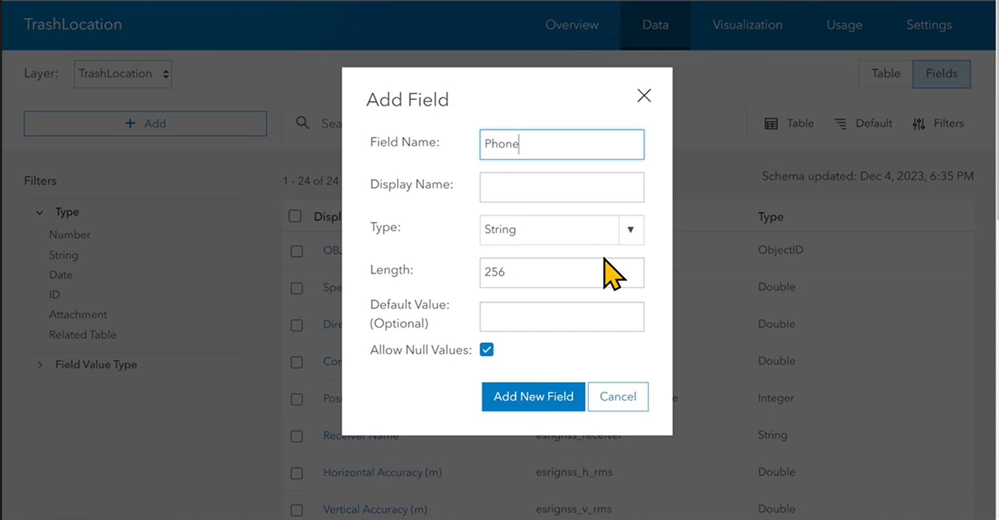

## 创建story map

**1）无需自己编程实现，只需调用story应用**

**2）我的故事地图**

**3）需要有一些Audience**

**4）年末需要提交你的最终工作成果**

## 要在ArcGIS training中选什么课?

## 使用Quick capture

**1）start from existing layers**

  	**当然，也可以从模板创建**

**2）先在自己的工作空间中，创建图层，使用GPS数据**

**3）而后，在layer中，编辑自定义的表数据**

**4）编辑完自定义layer后，在Quick capture中选择layer作为底图**

**5）编辑界面——Appearance**

**6）建立左侧的自定义的图标和layer数据之间的关联——Data**

**7）data还能加入自己的相机定位数据**

**8）分享项目**

**9）在ArcGIS Online中选择项目，编辑Metadata，可以选定view范围**

**最好在GIS领域的组里share这个APP，不要直接对公宣传，使有账号的人可以使用**

**10）dashboard——用于对收集的数据进行处理和可视化**

## What to do in olomoc?

项目可以放入一个组里头。

餐馆可以放在一个下拉栏里。（可以准备好几个按钮）

**让使用者明白自己要干什么？**

**结束调查后，告诉使用者离开。**

**给与更多的指导。。。**