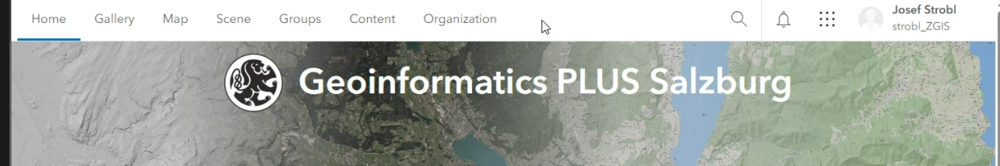

# How to use？

https://arcgis-zgis.hub.arcgis.com/pages/license

## WHOLE PROCESS

www.arcgis.com/

- **login with your organizaition’s URL**
- **enter ‘zgis’**

- **push PLUS button**
- **enter your ID & password**
- **设置My profiles个人信息，profile visibility设置为organization.**
- My settings常规设置：
  - 设为metrix
  - Licenses中下载最新版本的Arcgis pro
  - 关注Credits的消耗，就算用完了也可以续

图中的9个点可以启动应用。

`content`可以添加文件夹和工作内容。

`Groups`中有各种学习组，点击My organization’s Group，我们需要加入`SpatialAnalysis`组，

## GET TEACHING ONLINE

[esri Academy](http://www.esri.com/training/)